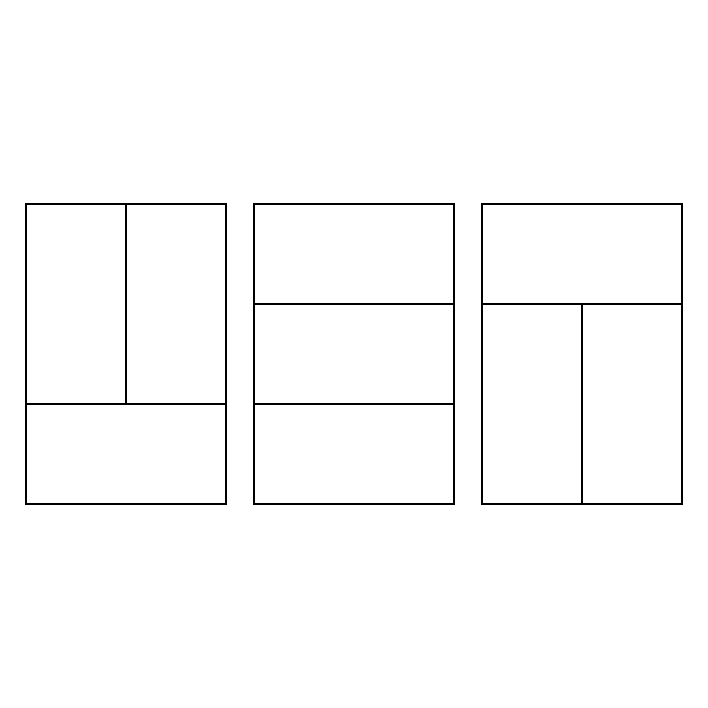
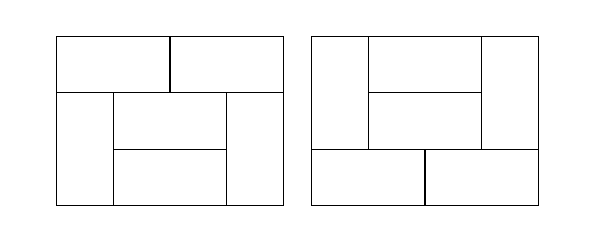
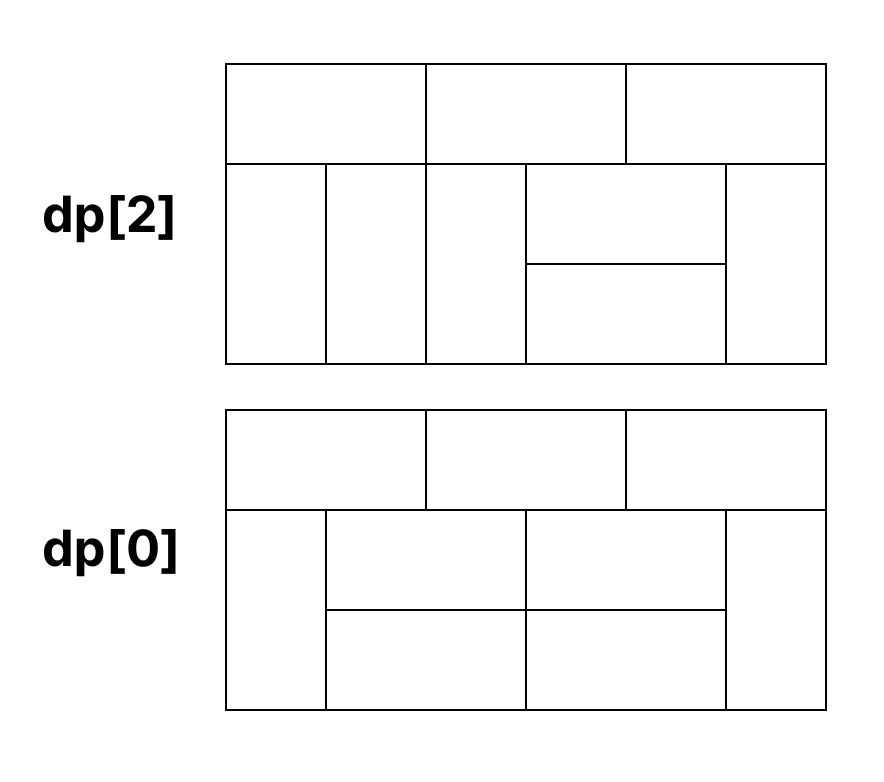

## 타일 채우기
|풀이 사이트|문제이름|난이도|
|:---:|:---:|:---:|
|[백준](https://www.acmicpc.net/problem/2133)|타일 채우기|골드 4|

### 문제 풀이
기존 타일 채우기 문제와 구성이 좀 다른 문제이다. 바로 높이가 1 늘었다. 그렇기 때문에 홀수 3xN에서 N이 홀수일 때, 무조건 빈칸이 생기게 된다. 이는 타일을 전부 채울 수 없는 구조이기 때문에 방법이 0이 된다. 처음에 빈칸이 생기더라도 타일을 채웠다고 가정해서 문제를 접근하기 힘들었다.

즉, 3xN에서 N이 `짝수`일 때만 타일을 채우는 것이 가능하다는 것인데, 문제의 예제에서 3x2의 공간에 타일을 채우는 방법은 `3개`라고 나와있다. 그림으로 표현하면 다음과 같다.



그럼 간단하게 3x4 타일을 채우는 방법은 몇개가 될까? 바로 3*3인 9개가 될 것이다. 이를 점화식으로 표현하면 다음과 같다.

```
// dp[0] = 1
dp[i] = dp[i-2] * 3
```

하지만 실제 3x4의 타일을 채우는 방법은 11가지이다. 그 이유는 아래와 같은 타일 조합이 추가로 있기 때문이다.



즉, 끝나는 모양이 `ㄱ자` 일떄와 `ㄴ자가 거꾸로 뒤집힌` 모양일 때를 생각해야 한다. 만약 3x6 공간에 타일을 채운다면 어떨까?



먼저 기본적인 경우의 수를 구하면
```
dp[6] = d[4] * 3
```
이 될 것이다. 이 후 특수한 타일로 끝나는 경우의 수를 구해야 한다. `dp[6]`은 위 사진과 같은 조합이 추가적으로 가능하다. `(3x4까지 특수한 타일의 조합이 모두 포함돼있어 신경쓰지 않아도 된다.)`
이는 dp[N]에서 N이 증가 할수록 더 많이 계산해야 하는데, 이를 코드로 구성하면 다음과 같다.

```java
for (int i=4; i<=N; i++) {
    if (i % 2 == 0) {
        dp[i] = dp[i-2] * 3;
        for (int k=i-4; k>=0; k--) {
            dp[i] += (dp[k] * 2);
        }
    } else {
        dp[i] = 0;
    }
}
```
dp[2]까지의 데이터를 미리 넣어두었다고 가정했을 때, dp[4]부터는 위 점화식를 가지는 코드를 통해 구할 수 있다. 이 때 중첩 for문이 중요한데, dp[4]부터는 특수한 타일로 끝나는 경우가 가능하다. dp[4]의 경우에는 2가지를 가진다. 또한 dp[6]에서는 8가지를 추가적으로 가진다. 이는 `dp[2] * 2 + dp[0] * 2`가 특수한 타일을 가지는 경우의 수이다. 

`dp[2] * 2`의 경우의 수는 `3x6`의 타일이 `ㄱ자`와 `ㄴ자가 뒤집힌 모양` 으로 끝나고, `3x6`에서 `3x3`까지 그러한 형태가 있다는 것이다. 그러면 이때 `3x2`는 3가지로 모양으로 변할 수 있기 때문에 3가지가 되고, `ㄱ자`와 `ㄴ자가 뒤집힌 모양`으로 총 2가지의 경우의 수가 있기 때문에 3*2를 통해 6의 경우의 수를 가진다. 추가적으로 3x6에서 3x1까지 특수한 타일을 가질 수 있기 때문에 이는 2가지로 총 `6 + 2 = 8` 8가지의 특수한 타일 조합을 추가적으로 가지게 된다.

```
dp[6] = (dp[4] * 3) + (dp[2] * 2) + (dp[0] * 2)
```