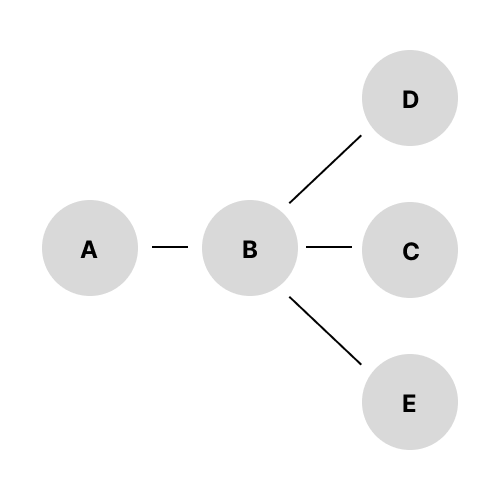

## 친구
|풀이 사이트|문제이름|난이도|
|:---:|:---:|:---:|
|[백준](https://www.acmicpc.net/problem/1058)|친구|실버2|

### 문제 풀이

그래프 탐색 및 브루트 포스를 통해 해결한 문제이다. 처음엔 문제 이해가 안됐었는데, 쉽게 말해서 친구 혹은 친구의 친구 (중복 허용 X)가 `2-친구`를 의미한다. 

위와 같은 친구 관계에 있을 떄 A의 `2-친구` 값은 직접 친구인 `B`, 간접 친구인 `C`, `D`, `E`로 **총 4명**이다. 

중복 허용을 방지하기 위해서 `Set<Integer> Collection` 을 문제 풀이에 활용했다.