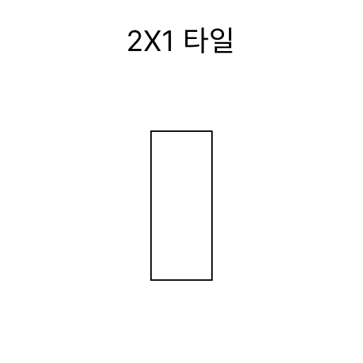
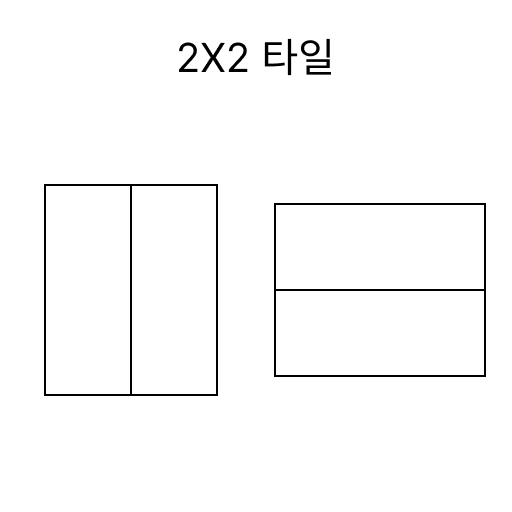
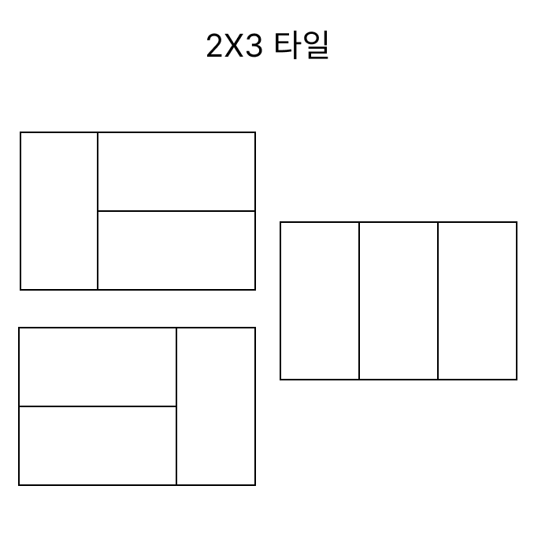

## 2xN 타일링

|풀이 사이트|문제이름|난이도|
|:---:|:---:|:---:|
|[백준](https://www.acmicpc.net/problem/11726)|2xN 타일링|실버3|

### 문제 풀이
피보나치 수열과 비슷한 방식으로 풀었다. 

직사각형의 크기가 2x1 일 때, 타일을 채우는 경우의 수는 1개이다.



다음 2x2 타일을 채우는 경우의 수는 2개이다.


2x3 타일을 채우는 경우의 수는 3개이다.



마지막에 `1x2` 타일을 채웠다면, 2x(N-1) 칸은 이미 채웠다는 이야기이다. 

마지막에 `2x1` 타일 2개를 가로로 붙인 경우는 2x(N-2) 칸은 이미 채웠다는 이야기이다. 이를 토대로 점화식을 세우면

```
dp[N] = dp[N-1] + dp[N-2]
```

가 된다. 즉 피보나치 수열과 똑같은 점화식을 가지게 된다.

