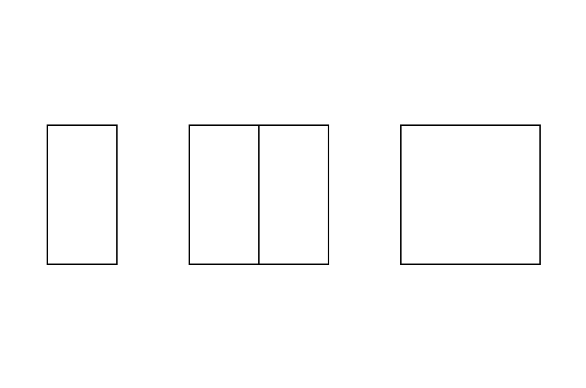
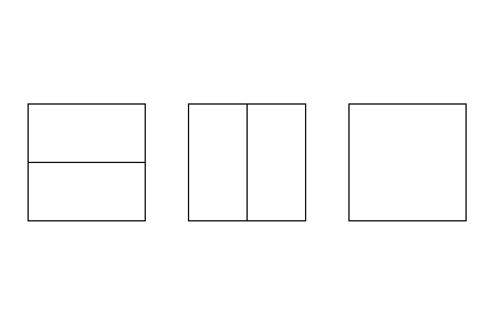
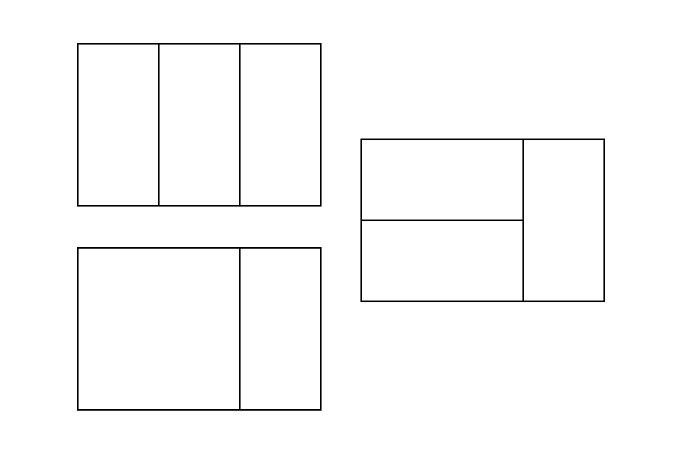
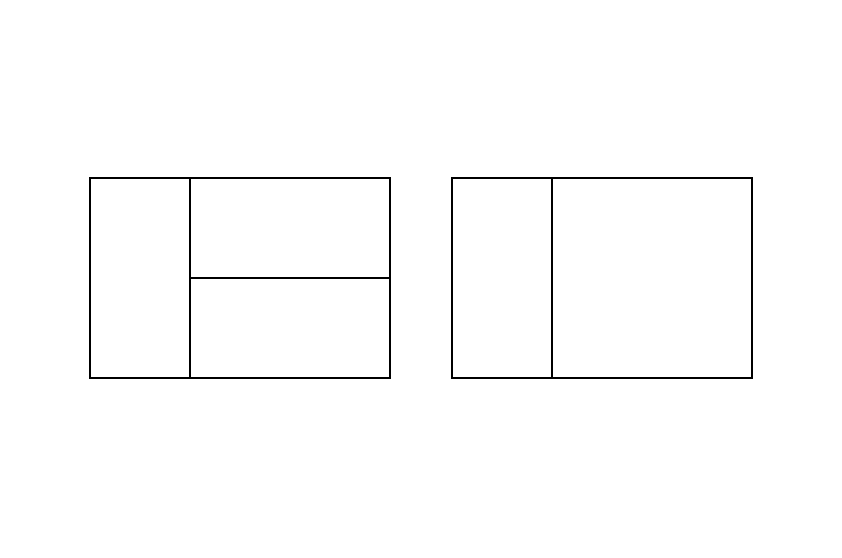

## 2xN 타일링 2

|풀이 사이트|문제이름|난이도|
|:---:|:---:|:---:|
|[백준](https://www.acmicpc.net/problem/11727)|2xN 타일링 2|실버 3|

### 문제 풀이

[백준 - [2xN 타일링]](../[실버3]%202xN%20타일링%20/README.md) 문제에서 타일이 한 가지 더 추가된 문제이다. 예전에 이런 문제를 처음 봤을 때, 엄청 어렵다고 느껴졌는데 뭔가 지금은 그랴도 풀 수는 있는 거 같아서 신기하다.

DP 문제이기 때문에, 점화식을 세우는 것 부터 생각했다. 



위와 같은 타일들을 배치할 수 있다.

- **N = 1일 때**
N = 1일 때는 가장 첫 번쨰 타일만 배치할 수 있다. dp[1] = 1 이다.
<br>
- **N = 2일 때**
N = 2일 때는 아래와 같이 배치할 수 있다.


- **N = 3일 때**
N = 3일 때는 어떻게 생각하면 좋을까? 먼저 끝에 어떤 타일이 오는지 생각하면 좋다.

    - 끝에 2x1 타일이 오는 경우
        

    - 끝에 나머지 타일이 오는 경우
        

끝에 어떤 타일이 올 수 있냐를 따져서 점화식은 다음과 같이 세울 수 있다.

```
dp[i] = dp[i-1] + dp[i-2] * 2
```
`dp[i-1]`은 끝에 2x1 짜리가 오는 경우이고, `dp[i-2] * 2`는 끝에 2x2 타일이 오는 경우의 수가 2개가 있으니 이를 2번 곱하는 것이다.
즉 `dp[3]`을 만들 때, `2x1 타일`이 끝에 붙는 경우는 `dp[2]`와 같다. 하지만 끝에 2x1 타일이 붙지 않는 경우도 있다. 그것이 바로 dp[i-2]와 같고, 이들은 `1x2 타일`이 2개 누운 타일 1개와, `2x2 타일`인 경우가 있으니 `* 2`를 하는 것이다.

```
dp[3] = dp[3-1] + dp[3-2] * 2
```

점화식을 세우는 감을 잘 잡으면 매우 쉽게 풀 수 있는 문제이다.