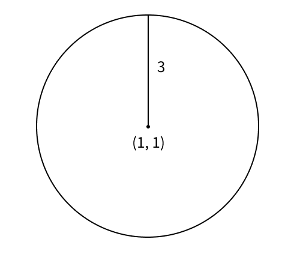
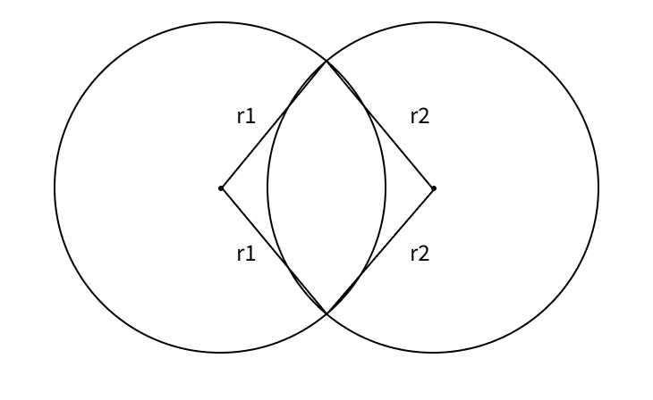
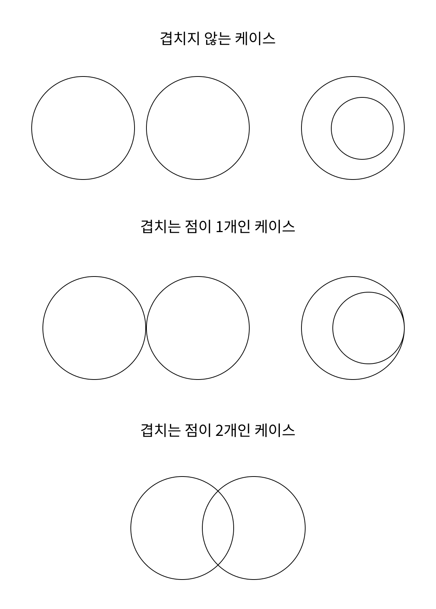

## 터렛

|풀이 사이트|문제이름|난이도|
|:---:|:---:|:---:|
|[백준](https://www.acmicpc.net/problem/1002)|터렛|실버 3|

### 문제 풀이

몇 년전에 백준을 처음 접했을 때, 풀어볼려고 시도했던 문제였던 거 같은데, 그 때 풀이 방법이 생각이 안나서 해설을 뒤져본 기억이 있는 문제이다. 이번에 뭔가 내 힘으로 풀었다는게 실력이 늘었다는 반증 같아서 뭔가 좋다.

먼저 두 사람의 위치를 기준으로 봐야하고, 두 사람의 위치와 마린과의 거리 (r1, r2)를 잘 생각해야 한다. 만약 (1,1) 라는 위치가 있고, 마린 까지의 거리가 3 이라면, 마린이 존재할 수 있는 위치는 (1, 1)를 중점으로 하는 원의 원주와 같다. 



즉, 위 사진의 검은색 둘레가 마린이 존재할 수 있는 위치이다. 하지만 여기서 원이 하나 더 추가되면 어떻게 될까? 바로 그 원들의 중점이 각 사람의 위치가 되고, 반지름이 주어진 r1, r2가 되는 원이 각 사람을 기준으로 마린이 존재할 수 있는 위치이다. 하지만 마린은 각각 존재할 수 없고, 두 사람의 동시에 위치를 찾을 수 있어야 한다. 즉 마린은 같은 위치에 존재할 수 있어야 한다. 

그렇다면 두 개의 원이 존재했을 때, 바로 겹치는 부분이 마린이 존재할 수 있는 위치이다. 즉 두 사람의 중점 (x1, y1)과 (x2, y2)를 기준으로 각 마린과의 거리 r1, r2를 만족하는 값이다. 



위 그림과 같은 경우, 주어진 조건을 만족하면서 마린이 존재할 수 있는 위치는 2개임을 확인할 수 있다. 그럼 이제 마린이 존재할 수 있는 조건은 원의 둘레가 겹치는 부분이라는 것을 알 수 있다.

그렇다면 다음과 같이 원이 깁치거나 겹치지 않는 상황으로 나눌 수 있다.




이 상황에 대해서 공식을 구하면 된다. 

**겹치지 않는 케이스**
겹치지 않는 케이스는 총 2가지이다. 
1. 원 안쪽에서 안 겹침
2. 원 바깥쪽에서 안 겹침

**(1)** 의 경우에는 `두 원의 중점 사이의 거리 (d)`보다 `r1 + r2`가 작은 상황이다. 
**(2)** 의 경우에는 `d`이 `|r2 - r1|` 보다 작은 경우이다.

**겹치는 점이 1개인 케이스**
겹치는 점이 1개인 케이스도 총 2가지이다.
1. 바깥에서 한 점이 겹침
2. 안쪽에서 한 점이 겹침

**(1)** 의 경우에는 `d`가 `r1 + r2`와 같은 경우이다.
**(2)** 의 경우에는 `|r2-r1|`이 `d`와 같은 경우이다.

**겹치는 점이 2개인 케이스**
그 외의 케이스는 모두 두 점이 만나는 케이스이기 때문에 따로 조건 분기를 나눌 필요 없다.

**겹치는 점이 무한대인 케이스**
겹치는 점이 무한대가 되려면 모든 점에서 만나야 한다. 두 사람의 위치가 같고, 마린과의 거리가 둘 다 똑같아야 한다.
즉, 다음 조건을 만족해야 한다.

```
x1 == x2 && y1 == y2 && r1 == r2
```

이러한 점을 바탕으로 코드를 작성한 예시이다.

```java
double distance = Math.abs(Math.sqrt(Math.pow((x2-x1), 2) + Math.pow((y2 - y1), 2)));

if (x1 == x2 && y1 == y2 && r1 == r2) results.add(-1);
else if (r1 + r2 == distance || Math.abs(r2 - r1) == distance) results.add(1);
else if (r1 + r2 < distance || Math.abs(r2 - r1) > distance) results.add(0);
else results.add(2);
```