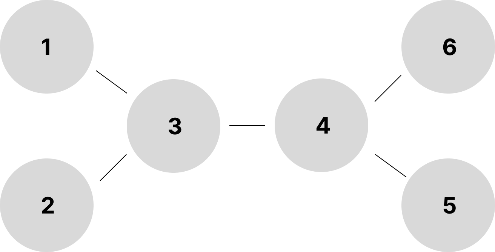

## 전력망을 둘로 나누기

|풀이 사이트|문제이름|난이도|
|:---:|:---:|:---:|
| [프로그래머스](https://school.programmers.co.kr/learn/courses/30/lessons/86971)|전력망을 둘로 나누기|Lv.2|

DFS를 통해 풀었다. 문제의 핵심은 전력망이 둘로 나뉘었을 때, 각각의 이어진 모든 송전탑의 개수를 구하는 것이다. 예를 들어 송전탑이 총 4개가 있고 (n=4), 연결은 다음과 같이 되어있다.
```
[[1,2], [2,3], [3,4]]
```

이런식으로 연결되어있을 때, 어디를 잘라야 둘로 나뉜 전력망에 연결된 송전탑의 개수의 차이가 가장 적은지 물어보는 문제이다. 위와 같은 상황의 경우 `[2,3]`을 자르게 되면 각각 전력망에 연결된 송전탑의 개수가 2개, 2개로 나뉘게 되고, 서로의 전력망의 송전탑의 개수 차이는 0개로 가장 적은 수가 된다. 

전력망이 둘로 나뉘었을 떄, 각 나눠지는 기준이 된 송전탑을 기점으로 DFS를 통해 연결된 송전탑의 개수를 찾아내고 이 둘의 차이를 구하여 min 값에 동기화 시키면 된다. 그리고 이러한 것을 모든 wires의 요소에 적용시키면, 어느 전선을 잘라야 서로의 차이가 최소가 되는지 알 수 있다.

```java
 public void dfs(int[][] wires, int cutWireIndex, int topNumber, boolean[] visited) {

    for (int i=0; i<wires.length; i++) {
        if (i != cutWireIndex) { // 잘린 전선은 패스
            if (wires[i][0] == topNumber && !visited[wires[i][1]]) {
                visited[wires[i][1]] = true;
                currentCount += 1;
                dfs(wires, cutWireIndex, wires[i][1], visited);
            }

            if (wires[i][1] == topNumber && !visited[wires[i][0]]) {
                visited[wires[i][0]] = true;
                currentCount += 1;
                dfs(wires, cutWireIndex, wires[i][0], visited);
            }
        }
    }
}
```

나의 경우는 wires[] 자체를 넘기고, 자른 전선를 제외한 배열을 순회하면서 DFS를 돌렸다.

다음은 문제의 새로운 접근 방식으로써, 다양한 문제 사고를 할 수 있을 것 같아, 첨부한다.



위와 같이 이루어진 전력망이 있다고 가정했을 때, 다음과 같은 과정을 통해 자식의 값을 구할 수 있다.

```
# '1'은 본인을 의미한다.

1 -> 3        -> 2 (return 1)
  (return 4+1=5)  -> 4       -> 5 (return 1)
              return (2+1=3) -> 6 (return 1)
```

먼저 DFS를 이용하게 되면 `1번 탑` -> `3번 탑`의 과정을 순회한다. 
거기서 `3번 탑`은 `2번 탑`과 `4번 탑`과 연결되어있고, `2번 탑`은 더 이상 이어진 송전탑이 없기 때문에 본인의 숫자인 `1`을 return 한다.
그리고 `4번 탑`으로 이동하여 DFS 하게 되고, `4번 탑`에는 `5번 탑`과 `6번 탑`이 이어져 있고, 각각 `1`을 return 한다.
그렇게 되면 `4번 탑`의 child는 3이 되고, 이를 다시 return 한다.
그리고 다시 `3번 탑`으로 돌아오면 child의 값은 5 (2번탑 child + 4번탑 child + 본인)가 된다.
이 때 각각 송전탑의 `child`를 구했을 때 `전체 송전탑 - child`의 값이 전력망을 끊었을 때의 차이가 되는데, 만약 `4번 탑`의 `child`를 구했을 때, `n = 6`이고, `child = 3` 이기 때문에 송전탑 개수의 차이는 3이 된다. 이런 방식으로 자식의 노드를 구해 `전체 노드 수 - 자식 노드` 라는 것을 통해 문제를 해결하는 방법도 있다.

